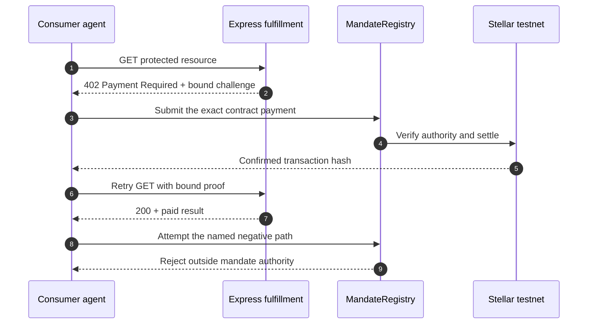

# ⚡ reapp-protocol-demo

**The live REAPP developer experience: 20 production-shaped starter packs for contract-enforced agent payments on Stellar testnet. The SDK prepares the request; the MandateRegistry contract decides whether money moves.**

[](https://reapp.live/hackathon)
[](https://stellar.expert/explorer/testnet)
[](https://reapp.live/hackathon#starter-packs)
[](https://nodejs.org/)
[](https://nextjs.org/)
[](https://reapp.live/express)

[](https://www.npmjs.com/package/@reapp-sdk/core)
[](https://www.npmjs.com/package/@reapp-sdk/stellar)
[](https://www.npmjs.com/package/@reapp-sdk/ap2)
[](https://www.npmjs.com/package/@reapp-sdk/express-middleware)

---

## Start here: empty folder to a working testnet demo

Go to **[reapp.live/hackathon](https://reapp.live/hackathon)** and follow five steps:

1. **Choose one** of the 20 starter packs.
2. **Open an empty folder** in VS Code, then select **Terminal → New Terminal**.
3. Click **Use this starter**, then copy the setup command displayed for that pack.
4. Paste the command into the terminal and press **Enter**. It downloads the starter into the empty folder and installs its exact dependencies.
5. Run **`npm run demo`**, then open the Stellar testnet links printed in the terminal.

That is the complete beginner path. You do **not** need a wallet or a GitHub repository. The starter creates disposable testnet actors, and private signing material stays on your computer.

```mermaid
flowchart LR
    A["① Choose a starter"] --> B["② Open an empty VS Code folder"]
    B --> C["③ Copy its displayed setup command"]
    C --> D["④ Paste once and press Enter"]
    D --> E["⑤ Run npm run demo"]
    E --> F["⑥ Inspect Stellar testnet evidence"]

    style A fill:#052e2b,stroke:#14b8a6,color:#ecfdf5
    style B fill:#082f49,stroke:#0ea5e9,color:#f0f9ff
    style C fill:#312e81,stroke:#818cf8,color:#eef2ff
    style D fill:#4c1d95,stroke:#a78bfa,color:#f5f3ff
    style E fill:#064e3b,stroke:#34d399,color:#ecfdf5
    style F fill:#0f172a,stroke:#7b73ff,color:#f8fafc
```



### What the displayed commands look like

The page generates the setup command for the starter you choose. For example, **Research Source Scout** displays this exact command:

```bash
curl -fsSLo reapp-hackathon.zip https://reapp.live/starters/v1/hackathon.zip && unzip -q reapp-hackathon.zip && rm reapp-hackathon.zip && npm ci
```

When it finishes, run:

```bash
npm run demo
```

The latest recorded clean-room run of the default starter completed setup and its full demo in **48.317 seconds**. Network and package-cache speed vary, so “about 60 seconds” is a measured target—not a guarantee.

### What success looks like

The terminal shows the local Express fulfillment server starting, the consumer receiving `402 Payment Required`, contract-controlled settlement on Stellar testnet, a retried request returning `200`, the starter's named rejection path, and clickable explorer evidence.



The SDK and Express middleware are untrusted clients of the contract. Merchant scope, amount, expiry, replay state, and remaining authority are verified before paid work is delivered.

---

## Choose from 20 starter packs

Every pack contains editable consumer and Express fulfillment source, deterministic fixtures, exact package versions, an offline gate check, a named rejection path, and a downloadable ZIP recorded in the [public SHA-256 manifest](https://reapp.live/starters/v1/manifest.json).

| # | Starter | Category | Level | Get it |
|---:|---|---|---|---|
| 01 | [**Research Source Scout**](https://github.com/reapp-protocol/reapp-protocol-demo/blob/main/starters/hackathon/README.md) | [](https://reapp.live/hackathon#starter-packs) |  | [](https://reapp.live/starters/v1/hackathon.zip) |
| 02 | [**Page Snapshot Meter**](https://github.com/reapp-protocol/reapp-protocol-demo/blob/main/starters/page-snapshot-meter/README.md) | [](https://reapp.live/hackathon#starter-packs) |  | [](https://reapp.live/starters/v1/page-snapshot-meter.zip) |
| 03 | [**Existing API Tollgate**](https://github.com/reapp-protocol/reapp-protocol-demo/blob/main/starters/api-tollgate/README.md) | [](https://reapp.live/hackathon#starter-packs) |  | [](https://reapp.live/starters/v1/api-tollgate.zip) |
| 04 | [**Paid Tool Gateway**](https://github.com/reapp-protocol/reapp-protocol-demo/blob/main/starters/paid-tool-gateway/README.md) | [](https://reapp.live/hackathon#starter-packs) |  | [](https://reapp.live/starters/v1/paid-tool-gateway.zip) |
| 05 | [**Coding Agent Purchase Hook**](https://github.com/reapp-protocol/reapp-protocol-demo/blob/main/starters/coding-agent-purchase-hook/README.md) | [](https://reapp.live/hackathon#starter-packs) |  | [](https://reapp.live/starters/v1/coding-agent-purchase-hook.zip) |
| 06 | [**Discoverable Service Bazaar**](https://github.com/reapp-protocol/reapp-protocol-demo/blob/main/starters/service-bazaar/README.md) | [](https://reapp.live/hackathon#starter-packs) |  | [](https://reapp.live/starters/v1/service-bazaar.zip) |
| 07 | [**Agent Reputation Snapshot**](https://github.com/reapp-protocol/reapp-protocol-demo/blob/main/starters/agent-reputation-snapshot/README.md) | [](https://reapp.live/hackathon#starter-packs) |  | [](https://reapp.live/starters/v1/agent-reputation-snapshot.zip) |
| 08 | [**Multi-Agent Workflow Router**](https://github.com/reapp-protocol/reapp-protocol-demo/blob/main/starters/multi-agent-workflow/README.md) | [](https://reapp.live/hackathon#starter-packs) |  | [](https://reapp.live/starters/v1/multi-agent-workflow.zip) |
| 09 | [**Verifiable Compute Broker**](https://github.com/reapp-protocol/reapp-protocol-demo/blob/main/starters/compute-broker/README.md) | [](https://reapp.live/hackathon#starter-packs) |  | [](https://reapp.live/starters/v1/compute-broker.zip) |
| 10 | [**Private Test Runner**](https://github.com/reapp-protocol/reapp-protocol-demo/blob/main/starters/private-test-runner/README.md) | [](https://reapp.live/hackathon#starter-packs) |  | [](https://reapp.live/starters/v1/private-test-runner.zip) |
| 11 | [**Build Notary**](https://github.com/reapp-protocol/reapp-protocol-demo/blob/main/starters/build-notary/README.md) | [](https://reapp.live/hackathon#starter-packs) |  | [](https://reapp.live/starters/v1/build-notary.zip) |
| 12 | [**Model Route Bazaar**](https://github.com/reapp-protocol/reapp-protocol-demo/blob/main/starters/model-route-bazaar/README.md) | [](https://reapp.live/hackathon#starter-packs) |  | [](https://reapp.live/starters/v1/model-route-bazaar.zip) |
| 13 | [**Rights Receipt**](https://github.com/reapp-protocol/reapp-protocol-demo/blob/main/starters/rights-receipt/README.md) | [](https://reapp.live/hackathon#starter-packs) |  | [](https://reapp.live/starters/v1/rights-receipt.zip) |
| 14 | [**Data Owner Gateway**](https://github.com/reapp-protocol/reapp-protocol-demo/blob/main/starters/data-owner-gateway/README.md) | [](https://reapp.live/hackathon#starter-packs) |  | [](https://reapp.live/starters/v1/data-owner-gateway.zip) |
| 15 | [**Human Review Outbox**](https://github.com/reapp-protocol/reapp-protocol-demo/blob/main/starters/human-review-outbox/README.md) | [](https://reapp.live/hackathon#starter-packs) |  | [](https://reapp.live/starters/v1/human-review-outbox.zip) |
| 16 | [**Cold-Chain Passport**](https://github.com/reapp-protocol/reapp-protocol-demo/blob/main/starters/cold-chain-passport/README.md) | [](https://reapp.live/hackathon#starter-packs) |  | [](https://reapp.live/starters/v1/cold-chain-passport.zip) |
| 17 | [**Carbon-Aware Run Window**](https://github.com/reapp-protocol/reapp-protocol-demo/blob/main/starters/carbon-aware-run-window/README.md) | [](https://reapp.live/hackathon#starter-packs) |  | [](https://reapp.live/starters/v1/carbon-aware-run-window.zip) |
| 18 | [**Fleet Corridor Authority**](https://github.com/reapp-protocol/reapp-protocol-demo/blob/main/starters/fleet-corridor-authority/README.md) | [](https://reapp.live/hackathon#starter-packs) |  | [](https://reapp.live/starters/v1/fleet-corridor-authority.zip) |
| 19 | [**Payment Receipt Firewall**](https://github.com/reapp-protocol/reapp-protocol-demo/blob/main/starters/payment-receipt-firewall/README.md) | [](https://reapp.live/hackathon#starter-packs) |  | [](https://reapp.live/starters/v1/payment-receipt-firewall.zip) |
| 20 | [**Procurement Guard**](https://github.com/reapp-protocol/reapp-protocol-demo/blob/main/starters/procurement-guard/README.md) | [](https://reapp.live/hackathon#starter-packs) |  | [](https://reapp.live/starters/v1/procurement-guard.zip) |

### Make any starter yours

Start with three files; the payment and recovery machinery can stay untouched until you need advanced customization.

| File | What you change |
|---|---|
| `scenario/scenario.mjs` | Your product rules, fixtures, delivery checks, and rejection check. |
| `src/consumer.mjs` | How your app requests and pays for the protected result. |
| `src/fulfillment.mjs` | What your paid Express endpoint returns. |

---

## Live protocol surfaces

This repository powers the implementation guide and inspectable demonstrations at [reapp.live](https://reapp.live):

| Surface | What it demonstrates |
|---|---|
| [**Docs**](https://reapp.live/) | SDK installation, consumer flow, Express verification, testnet execution, and safety boundary. |
| [**CLI**](https://reapp.live/cli) | Actor setup, mandate creation, payment, and terminal rejection paths. |
| [**Express**](https://reapp.live/express) | `402` challenge, contract settlement, one-time redemption, and `200` fulfillment. |
| [**Hackathon**](https://reapp.live/hackathon) | Twenty blank-folder starters plus the optional hosted Research Source Scout walkthrough. |
| [**AP2**](https://reapp.live/ap2) | Intent and transaction mandate binding, canonical signatures, scope, expiry, and replay checks. |
| [**Composite mandates**](https://reapp.live/composites) | Multiple buyer agents coordinating an atomic group purchase. |
| [**Research agent**](https://reapp.live/research) | Paid-source selection constrained by an on-chain budget. |
| [**Video paywall**](https://reapp.live/video) | Three permitted unlocks followed by a contract-rejected fourth payment. |

Machine-readable maps are available at [`/llms.txt`](https://reapp.live/llms.txt), [`/llms-full.txt`](https://reapp.live/llms-full.txt), [`/sitemap.xml`](https://reapp.live/sitemap.xml), and [`/robots.txt`](https://reapp.live/robots.txt).

REAPP is the live implementation companion to [REAPP NETWORK](https://reapp.network), the source-linked research and architecture field guide for agentic payments.

## Run this site locally

```bash
npm ci
npm run dev
```

Open [http://localhost:3000](http://localhost:3000). Everything is configured for Stellar **testnet**; never use mainnet keys in this demo.

Run the hackathon gate check before changing the starter library:

```bash
npm run gatecheck:hackathon
```

The research agent additionally supports Anthropic and OpenAI. Add one or both variables to `.env.local` (already ignored by Git) and to the deployed environment:

```dotenv
ANTHROPIC_API_KEY=
OPENAI_API_KEY=
```

Without an LLM key, the starter library, Express, CLI, AP2, composite, and video demonstrations remain available; the research page shows a clear notice.

## Repository map

- `app/hackathon/page.tsx` — starter picker, exact setup commands, and optional hosted walkthrough.
- `starters/` — the 20 generated, inspectable starter projects.
- `starter-kit-src/` — catalog, scenarios, and shared source used to generate the starter library.
- `scripts/starters/` — deterministic materialization, ZIP generation, manifest creation, and verification.
- `app/api/express/` — hosted Express session and fulfillment routes.
- `lib/reapp-server.ts` — server-side integration with `@reapp-sdk/core`.
- `app/` — the documentation and demonstration surfaces listed above.

Contract and protocol source: [reapp-protocol/reapp-protocol](https://github.com/reapp-protocol/reapp-protocol)

**Verify the request. Verify the contract decision. Verify the settlement.**
