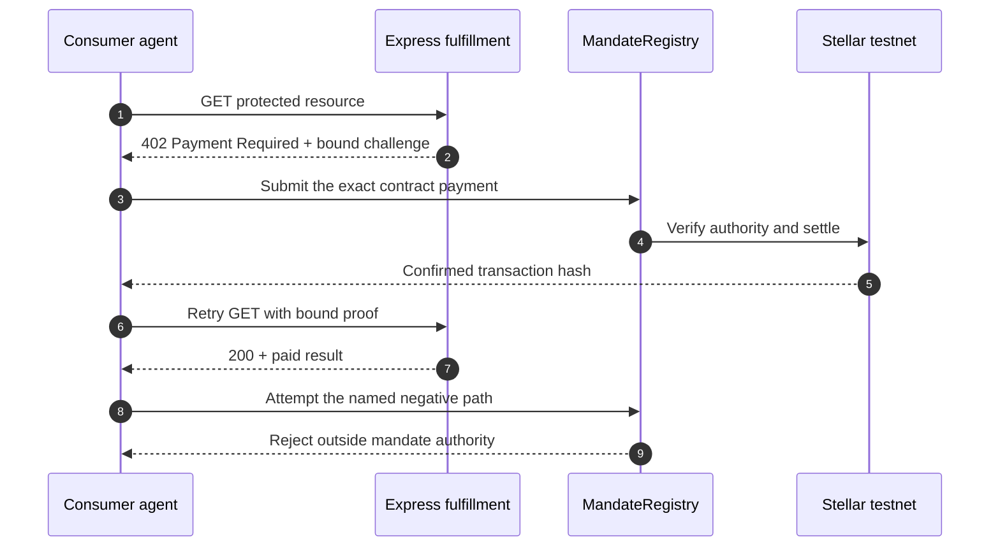

# ⚡ reapp-protocol-demo

**The live REAPP developer experience: 20 production-shaped starter packs for contract-enforced agent payments on Stellar testnet. The SDK prepares the request; the MandateRegistry contract decides whether money moves.**

---

## Choose from 20 starter packs

Share the full catalog with your team at **[reapp.live/hackathon](https://reapp.live/hackathon)**. Each starter name below opens a standalone README you can share directly; each ZIP link downloads that exact starter.

Every pack contains editable consumer and Express fulfillment source, deterministic fixtures, exact package versions, an offline gate check, a named rejection path, and a downloadable ZIP recorded in the [public SHA-256 manifest](https://reapp.live/starters/v1/manifest.json).

| # | Starter | Category | Level | Download |
|---:|---|---|---|---|
| 01 | [**Research Source Scout**](https://github.com/reapp-protocol/reapp-protocol-demo/blob/main/starters/hackathon/README.md) | Data APIs | Beginner | [ZIP](https://reapp.live/starters/v1/hackathon.zip) |
| 02 | [**Page Snapshot Meter**](https://github.com/reapp-protocol/reapp-protocol-demo/blob/main/starters/page-snapshot-meter/README.md) | Content infrastructure | Intermediate | [ZIP](https://reapp.live/starters/v1/page-snapshot-meter.zip) |
| 03 | [**Existing API Tollgate**](https://github.com/reapp-protocol/reapp-protocol-demo/blob/main/starters/api-tollgate/README.md) | Infrastructure | Beginner | [ZIP](https://reapp.live/starters/v1/api-tollgate.zip) |
| 04 | [**Paid Tool Gateway**](https://github.com/reapp-protocol/reapp-protocol-demo/blob/main/starters/paid-tool-gateway/README.md) | Agent tooling | Intermediate | [ZIP](https://reapp.live/starters/v1/paid-tool-gateway.zip) |
| 05 | [**Coding Agent Purchase Hook**](https://github.com/reapp-protocol/reapp-protocol-demo/blob/main/starters/coding-agent-purchase-hook/README.md) | Developer tooling | Intermediate | [ZIP](https://reapp.live/starters/v1/coding-agent-purchase-hook.zip) |
| 06 | [**Discoverable Service Bazaar**](https://github.com/reapp-protocol/reapp-protocol-demo/blob/main/starters/service-bazaar/README.md) | Discovery | Advanced | [ZIP](https://reapp.live/starters/v1/service-bazaar.zip) |
| 07 | [**Agent Reputation Snapshot**](https://github.com/reapp-protocol/reapp-protocol-demo/blob/main/starters/agent-reputation-snapshot/README.md) | Identity | Advanced | [ZIP](https://reapp.live/starters/v1/agent-reputation-snapshot.zip) |
| 08 | [**Multi-Agent Workflow Router**](https://github.com/reapp-protocol/reapp-protocol-demo/blob/main/starters/multi-agent-workflow/README.md) | Orchestration | Advanced | [ZIP](https://reapp.live/starters/v1/multi-agent-workflow.zip) |
| 09 | [**Verifiable Compute Broker**](https://github.com/reapp-protocol/reapp-protocol-demo/blob/main/starters/compute-broker/README.md) | Compute | Intermediate | [ZIP](https://reapp.live/starters/v1/compute-broker.zip) |
| 10 | [**Private Test Runner**](https://github.com/reapp-protocol/reapp-protocol-demo/blob/main/starters/private-test-runner/README.md) | Developer tooling | Intermediate | [ZIP](https://reapp.live/starters/v1/private-test-runner.zip) |
| 11 | [**Build Notary**](https://github.com/reapp-protocol/reapp-protocol-demo/blob/main/starters/build-notary/README.md) | Software supply chain | Advanced | [ZIP](https://reapp.live/starters/v1/build-notary.zip) |
| 12 | [**Model Route Bazaar**](https://github.com/reapp-protocol/reapp-protocol-demo/blob/main/starters/model-route-bazaar/README.md) | AI infrastructure | Advanced | [ZIP](https://reapp.live/starters/v1/model-route-bazaar.zip) |
| 13 | [**Rights Receipt**](https://github.com/reapp-protocol/reapp-protocol-demo/blob/main/starters/rights-receipt/README.md) | Creative commerce | Beginner | [ZIP](https://reapp.live/starters/v1/rights-receipt.zip) |
| 14 | [**Data Owner Gateway**](https://github.com/reapp-protocol/reapp-protocol-demo/blob/main/starters/data-owner-gateway/README.md) | Data commerce | Intermediate | [ZIP](https://reapp.live/starters/v1/data-owner-gateway.zip) |
| 15 | [**Human Review Outbox**](https://github.com/reapp-protocol/reapp-protocol-demo/blob/main/starters/human-review-outbox/README.md) | Operations | Advanced | [ZIP](https://reapp.live/starters/v1/human-review-outbox.zip) |
| 16 | [**Cold-Chain Passport**](https://github.com/reapp-protocol/reapp-protocol-demo/blob/main/starters/cold-chain-passport/README.md) | Supply chain | Intermediate | [ZIP](https://reapp.live/starters/v1/cold-chain-passport.zip) |
| 17 | [**Carbon-Aware Run Window**](https://github.com/reapp-protocol/reapp-protocol-demo/blob/main/starters/carbon-aware-run-window/README.md) | Sustainability | Intermediate | [ZIP](https://reapp.live/starters/v1/carbon-aware-run-window.zip) |
| 18 | [**Fleet Corridor Authority**](https://github.com/reapp-protocol/reapp-protocol-demo/blob/main/starters/fleet-corridor-authority/README.md) | Operations | Intermediate | [ZIP](https://reapp.live/starters/v1/fleet-corridor-authority.zip) |
| 19 | [**Payment Receipt Firewall**](https://github.com/reapp-protocol/reapp-protocol-demo/blob/main/starters/payment-receipt-firewall/README.md) | Security | Advanced | [ZIP](https://reapp.live/starters/v1/payment-receipt-firewall.zip) |
| 20 | [**Procurement Guard**](https://github.com/reapp-protocol/reapp-protocol-demo/blob/main/starters/procurement-guard/README.md) | Small-business automation | Beginner | [ZIP](https://reapp.live/starters/v1/procurement-guard.zip) |

### Make any starter yours

Start with three files; the payment and recovery machinery can stay untouched until you need advanced customization.

| File | What you change |
|---|---|
| `scenario/scenario.mjs` | Your product rules, fixtures, delivery checks, and rejection check. |
| `src/consumer.mjs` | How your app requests and pays for the protected result. |
| `src/fulfillment.mjs` | What your paid Express endpoint returns. |

---

## Start here: empty folder to a working testnet demo

Go to **[reapp.live/hackathon](https://reapp.live/hackathon)** and follow five steps:

1. **Choose one** of the 20 starter packs.
2. **Open an empty folder** in VS Code, then select **Terminal → New Terminal**.
3. Click **Use this starter**, then copy the setup command displayed for that pack.
4. Paste the command into the terminal and press **Enter**. It downloads the starter into the empty folder and installs its exact dependencies.
5. Run **`npm run demo`**, then open the Stellar testnet links printed in the terminal.

That is the complete beginner path. You do **not** need a wallet or a GitHub repository. The starter creates disposable testnet actors, and private signing material stays on your computer.


### What the copied setup command does

The page shows one setup command for the starter you choose. Copy it as-is; it verifies the versioned REAPP installer, and that installer verifies the ZIP against its exact published SHA-256 before extracting anything. It then removes the temporary files and installs the locked dependencies. A changed or incomplete download is deleted before extraction.

When the setup command finishes, run:

```bash
npm run demo
```

The latest recorded clean-room run of the default starter completed setup and its full demo in **48.317 seconds**. Network and package-cache speed vary, so “about 60 seconds” is a measured target—not a guarantee.

### Prefer to inspect a clone first?

The ZIPs are the shortest beginner path. Security reviewers can run the same generated starter directly from the public source repository:

```bash
git clone --depth 1 https://github.com/reapp-protocol/reapp-protocol-demo.git
cd reapp-protocol-demo/starters/hackathon
npm ci
npm run demo
```

Every starter folder is self-contained. Replace `hackathon` with any of the other starter slugs in the table above.

### What success looks like

The terminal uses six numbered, plain-English steps. It explains that `402 Payment Required` means the API is protected—not broken—then shows contract-controlled settlement, the retried `200` response, full clickable Stellar explorer links, and the starter's named safety or recovery result. Set `REAPP_VERBOSE=1` only when you also want the underlying developer event names.



The SDK and Express middleware are untrusted clients of the contract. Merchant scope, amount, expiry, replay state, and remaining authority are verified before paid work is delivered.

---

## Live protocol surfaces

This repository powers the implementation guide and inspectable demonstrations at [reapp.live](https://reapp.live):

| Surface | What it demonstrates |
|---|---|
| [**Docs**](https://reapp.live/) | SDK installation, consumer flow, Express verification, testnet execution, and safety boundary. |
| [**CLI**](https://reapp.live/cli) | Actor setup, mandate creation, payment, and terminal rejection paths. |
| [**Consumer**](https://reapp.live/consumer) | A product preview for turning a consumer request, budget, scope, expiry, and approval rule into bounded agent authority. |
| [**Express**](https://reapp.live/express) | `402` challenge, contract settlement, one-time redemption, and `200` fulfillment. |
| [**Hackathon**](https://reapp.live/hackathon) | Twenty blank-folder starters plus the optional hosted Research Source Scout walkthrough. |
| [**AP2**](https://reapp.live/ap2) | Intent and transaction mandate binding, canonical signatures, scope, expiry, and replay checks. |
| [**Composite mandates**](https://reapp.live/composites) | Multiple buyer agents coordinating an atomic group purchase. |
| [**Research agent**](https://reapp.live/research) | Paid-source selection constrained by an on-chain budget. |
| [**Video paywall**](https://reapp.live/video) | Three permitted unlocks followed by a contract-rejected fourth payment. |

Machine-readable maps are available at [`/llms.txt`](https://reapp.live/llms.txt), [`/llms-full.txt`](https://reapp.live/llms-full.txt), [`/sitemap.xml`](https://reapp.live/sitemap.xml), and [`/robots.txt`](https://reapp.live/robots.txt).

REAPP is the live implementation companion to [REAPP NETWORK](https://reapp.network), the source-linked research and architecture field guide for agentic payments.

## Run this site locally

```bash
npm ci
npm run dev
```

Open [http://localhost:3000](http://localhost:3000). Everything is configured for Stellar **testnet**; never use mainnet keys in this demo.

Run the hackathon gate check before changing the starter library:

```bash
npm run gatecheck:hackathon
```

The research agent additionally supports Anthropic and OpenAI. Add one or both variables to `.env.local` (already ignored by Git) and to the deployed environment:

```dotenv
ANTHROPIC_API_KEY=
OPENAI_API_KEY=
```

Without an LLM key, the starter library, Express, CLI, AP2, composite, and video demonstrations remain available; the research page shows a clear notice.

## Repository map

- `app/hackathon/page.tsx` — starter picker, exact setup commands, and optional hosted walkthrough.
- `starters/` — the 20 generated, inspectable starter projects.
- `starter-kit-src/` — catalog, scenarios, and shared source used to generate the starter library.
- `scripts/starters/` — deterministic materialization, ZIP generation, manifest creation, and verification.
- `app/api/express/` — hosted Express session and fulfillment routes.
- `lib/reapp-server.ts` — server-side integration with `@reapp-sdk/core`.
- `app/` — the documentation and demonstration surfaces listed above.

Contract and protocol source: [reapp-protocol/reapp-protocol](https://github.com/reapp-protocol/reapp-protocol)

**Verify the request. Verify the contract decision. Verify the settlement.**
