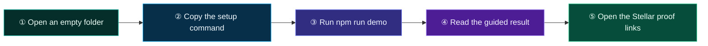
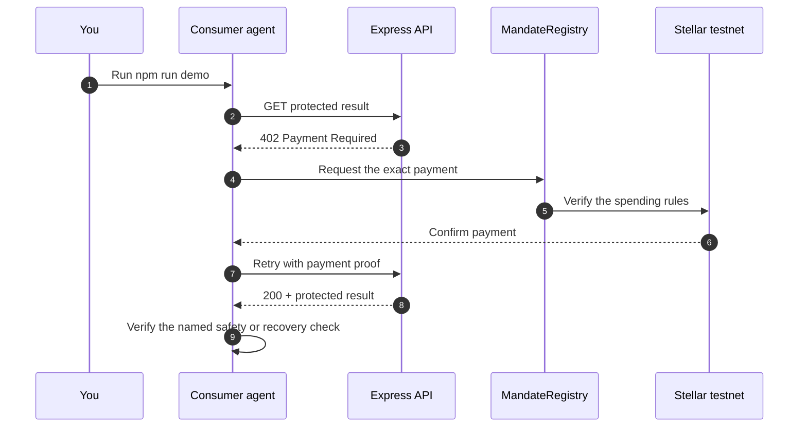

# Multi-Agent Workflow Router

**A planner purchases research, verification, and synthesis artifacts as an explicit dependency graph.**

This starter protects `GET /workflow/:caseId/:stage` with a request-bound payment on Stellar testnet. The app asks; the MandateRegistry contract decides whether money moves.

## Start — two commands, no wallet

You need Node.js 20 or newer. You do not need a wallet or a GitHub repo.

### If you used Copy setup command

The setup command on [reapp.live/hackathon](https://reapp.live/hackathon) already downloaded this starter, extracted it into your empty folder, and ran `npm ci`. Before extraction, it verified the ZIP against the exact SHA-256 in the [public integrity manifest](https://reapp.live/starters/v1/manifest.json). In the same VS Code terminal, run:

```bash
npm run demo
```

### If you downloaded the ZIP manually

Compare its SHA-256 with the [public integrity manifest](https://reapp.live/starters/v1/manifest.json), extract the ZIP, open the extracted folder in VS Code, select **Terminal → New Terminal**, then run:

```bash
npm ci
npm run demo
```

The demo creates disposable testnet accounts, starts the consumer and Express fulfillment service, and explains every step in plain English. It never requests a wallet or mainnet secret.



## What the terminal will teach you

The guided output uses six numbered steps and explains the important words:

1. **Testnet accounts** are temporary practice accounts. No real money is used.
2. **HTTP 402** means the API is working and requires payment.
3. **Contract approval** means the user's exact spending rules allowed the payment.
4. **HTTP 200** means the paid result was delivered.
5. **Stellar proof links** let anyone inspect each accepted payment.
6. **The safety check** proves this starter's named boundary or recovery behavior.

The terminal shows the local fulfillment server starting, accepted Stellar testnet payment evidence with explorer transaction hashes, the protected result delivered to the consumer, and the named negative or recovery check reaching its documented outcome.



## Scenario

- Paid resource: `GET /workflow/:caseId/:stage`
- Price policy: exact decimal amounts declared by the scenario
- Safety or recovery check: `failed-stage-blocks-synthesis`
- Expected outcome: A failed verification stage prevents synthesis from running.
- Fixtures: Two deterministic case graphs with staged artifact identifiers and one intentional verification failure.

Offline vectors validate DAG dependencies, stage order, and failure blocking; the live plan purchases the clean-case stages in fixed order.

### Capabilities

- `verified-bound-purchase`
- `dependency-validation`
- `sequence-validation`
- `explorer-evidence`

## Make it yours

Start with these three files:

| File | What to change |
|---|---|
| `scenario/scenario.mjs` | Your product's rules, sample data, delivery checks, and rejection check. |
| `src/consumer.mjs` | How your app requests and pays for the protected result. |
| `src/fulfillment.mjs` | What your paid Express endpoint returns. |

The shared payment and recovery code lives in `shared/`. Leave it unchanged until your project needs advanced customization.

## Run fulfillment separately

The one-command demo starts both sides automatically. To inspect or modify the server independently:

```bash
cp .env.example .env
# Put a funded Stellar testnet public G-address in REAPP_MERCHANT.
npm run fulfillment
```

Keep the challenge secret private and stable. The reference file store is for one local Node process; multi-process deployments need one shared linearizable store implementing the same interface.

## Safety and recovery

- Paid work is GET-only and bound to the exact origin, method, resource, merchant, asset, amount, registry, and short-lived challenge.
- Delivery evidence is committed before the client acknowledges and clears a settlement receipt.
- Exact same-proof replay returns byte-identical recovery; an old proof on a new resource is rejected, and a freshly rebound proof reusing an old transaction conflicts.
- State under `.reapp/` is private and ignored by Git. Run `npm run reset` only after all payment and fulfillment evidence is resolved.

Catalog identity: `multi-agent-workflow` · fixture policy: `deterministic-and-clearly-labeled`.
